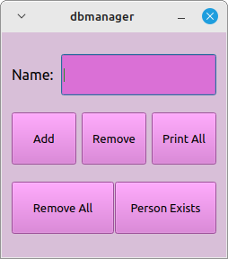
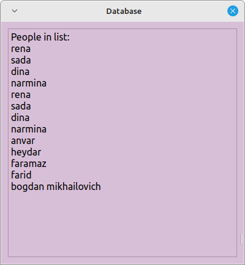
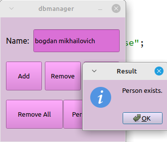

# Database  

Приложение для управления базой данных.  
Присутствуют функции добавления, удаления, проверки существования и вывода всех записей.  

# Как работает прогорамма:  

В функции *addPerson()* добавляем запись в базу данных.

В функции *сheckPersonExists()* проверяем существование, указанной записи.  

В функции *removePerson()* удаляем указанную запись.  

В функции *printAll()* выводим все записи.

В функции *removeAll()* удаляем все записи из базы данных.

В функции *tableView()* инициализируем пользовательский интерфейс.  

  

  

  
